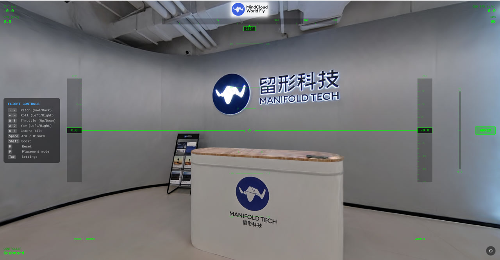
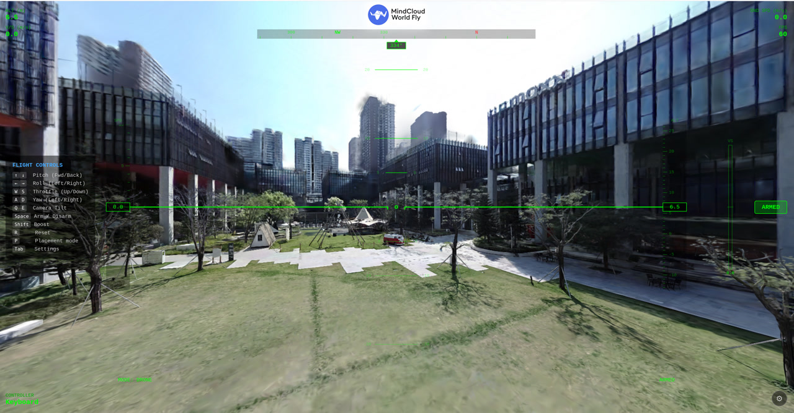

# MindCloud World Fly

<p align="center">
  
</p>

<p align="center">
  
</p>

<p align="center">
  
</p>

A browser-based drone flight simulator for 3D Gaussian Splatting scenes. Fly through any 3DGS scene with realistic physics, FPV or stabilized drone controls, and RC transmitter support.

## About Manifold Tech

[Manifold Tech Ltd.](https://manifoldtech.cn) builds tools and infrastructure for spatial intelligence. We focus on 3D reconstruction, scene understanding, and embodied AI — bridging the gap between real-world capture and interactive simulation.

Manifold Tech's hardware products — including the **Q9000**, **Pocket 2 / 2 Pro**, and **Odin 1** — can capture high-quality 3D Gaussian Splatting models of real-world environments. These 3DGS scenes can then be loaded directly into MindCloud World Fly as flyable environments, enabling realistic drone flight simulation through your own scanned spaces.

## Quick Start

```bash
python3 serve.py
```

Open **http://localhost:8080** in your browser (Chrome/Edge recommended for Gamepad API).

## Supported Formats

| Format | Extension | Description |
|--------|-----------|-------------|
| PLY    | `.ply`    | Standard 3DGS point cloud |
| SPLAT  | `.splat`  | Compressed splat format (auto-converted to PLY for rendering) |
| SOG    | `.sog`    | Compressed archive format (always Y-up) |

Drag and drop a file onto the page, or click **Choose File** to browse.

## Demo Scene

A ready-to-fly demo scene is available on Google Drive: [**field_z-up.sog**](https://drive.google.com/file/d/11yztizITalnHwnichd4iXHVaQbMYplTD/view?usp=sharing). This scene was captured using Manifold Tech hardware and showcases a real-world outdoor environment reconstructed as a 3D Gaussian Splatting model. Note that this scene uses the **Z-up** coordinate system — select **Z-up** in the coordinate system dropdown during the filter step. Download the file, then drag and drop it onto the page to start flying immediately.

## User Guide

### Step 1: Load a Scene

1. Open the app in your browser at **http://localhost:8080**
2. **Drag and drop** a `.ply`, `.splat`, or `.sog` file onto the page, or click **Choose File**
3. Wait for parsing and engine initialization (progress shown on screen)

### Step 2: Filter the Scene

After loading, you enter the **Filter** stage with an orbit camera view of the full scene:

- **Distance** slider — crop points beyond a radius from the scene centroid (removes outliers and sky noise)
- **Opacity** slider — hide low-opacity Gaussians (cleans up semi-transparent artifacts)
- **Up Axis** selector — choose **Z-Up** or **Y-Up** to match your scene's coordinate system. The preview updates live as you switch. For `.sog` files this is auto-set to Y-Up and hidden.
- **Point count** is displayed in real time as you adjust sliders

Camera controls during filtering:
- **Left-drag** to orbit
- **Scroll** to zoom

Click **Apply** when satisfied. The chosen coordinate system is locked and shown (read-only) in the settings panel.

> **Tip:** If the scene appears sideways or upside down, you likely have the wrong Up Axis. Press **Esc** to exit and reload the file with the correct setting.

### Step 3: Place the Drone

After filtering, you enter **Placement Mode**:

| Control | Action |
|---------|--------|
| W / S | Move drone forward / back (relative to camera view) |
| A / D | Move drone left / right |
| Q / E | Move drone down / up |
| Left-drag | Orbit camera around drone |
| Scroll | Zoom in / out |
| Enter | Confirm placement and start flying |
| Esc | Exit scene (with confirmation) |

A blue marker shows the drone's spawn position. The camera orbits around it as you move.

### Step 4: Fly

Press **Enter** to confirm placement. The view switches to the drone's onboard camera.

**Before you can fly, you must arm the drone:**
- Press **Space** on keyboard, or
- Press the assigned arm button on your controller

The status indicator at the bottom of the screen shows **ARMED** (green) or **DISARMED** (red).

### Flight Controls (Keyboard)

| Key | Action |
|-----|--------|
| W / S | Throttle up / down |
| A / D | Yaw left / right |
| ↑ / ↓ | Pitch forward / back |
| ← / → | Roll left / right |
| Q / E | Camera tilt up / down (drone mode) |
| Space | Arm / disarm toggle |
| R | Reset drone to spawn point |
| Shift | Boost (1.5× thrust) |
| P | Return to placement mode (reposition drone) |
| Tab | Open settings panel |
| Esc | Close settings panel, or exit scene |

### Flight Controls (RC Transmitter)

Connect your RC transmitter via USB. It appears as a gamepad via the browser Gamepad API.

Default channel mapping (AETR):

| Axis | Action |
|------|--------|
| 0 | Roll |
| 1 | Pitch |
| 2 | Throttle |
| 3 | Yaw |
| Button 0 | Arm toggle |
| Button 1 | Reset |

### Flight Modes

| Mode | Behavior |
|------|----------|
| **Drone (Easy)** | Stabilized flight with position and altitude hold. Sticks command velocity — release to hover. Cascaded PI controller keeps the drone level and on target. Best for exploration. |
| **FPV (Manual)** | Direct rate control — sticks map to body-frame angular rates (pitch, roll, yaw). No self-leveling. Throttle directly controls thrust. Requires constant pilot input. Realistic FPV experience. |

Switch modes any time in the settings panel (**Tab**).

**Drone mode** uses a fixed camera tilt angle (set in settings, 0–60°). **FPV mode** uses a fixed mount angle during flight; adjust Q/E before arming, or set it in settings.

### HUD & OSD

During flight, the screen displays:

- **HUD (corners):** altitude, vertical speed, ground speed, FPS, controller status, armed state
- **OSD (center overlay):** artificial horizon with pitch ladder, heading compass, altitude and speed tapes, vertical speed indicator, flight mode label
- **Collision warning:** screen flashes red and shows "COLLISION" text on impact

The FPV OSD overlay can be toggled on/off in settings (Display → FPV OSD Overlay).

### Settings Panel

Press **Tab** to open. Sections:

- **Display** — toggle FPV OSD overlay
- **RC Channel Assignment** — assign and invert axes, set dead zones (default 0), with listen-mode auto-detect
- **Button Assignment** — assign arm/reset to buttons or axis thresholds
- **Gamepad Status** — shows connected controller name
- **Channel Monitor** — real-time axis values from the gamepad
- **Coordinate System** — shows the Up Axis chosen during filtering (read-only)
- **Flight Mode** — switch between Drone (Easy) and FPV (Manual)
- **FPV Cam Angle** — camera mount tilt for FPV mode (0–60°)
- **Controller Gains** — tune Pos Kp/Ki, Vel Kp/Ki, Alt Kp/Ki for drone mode
- **Physics** — mass, max thrust, drag Cd, frontal area, drone size, collision radius
- **Export / Import** — save or load full configuration as JSON

All settings persist automatically in `localStorage`.

### Remapping Controls

1. Press **Tab** to open settings
2. Click **Assign** next to any axis or button action
3. Move the stick or press the button on your transmitter
4. Use **Invert** checkbox if axis direction is reversed
5. Adjust **Dead Zone** sliders as needed (default is 0)

You can also **Export** / **Import** full configs as JSON files to share between browsers or back up your setup.

## Physics

Quaternion-based orientation with body-frame rotations. Thrust along local up axis, quadratic aerodynamic drag, and gravity.

| Parameter | Default | Description |
|-----------|---------|-------------|
| Mass | 500 g | Drone mass |
| Max Thrust | 1000 gf | Maximum thrust force |
| Drag Cd | 1.0 | Drag coefficient |
| Frontal Area | 0.01 m² | Reference area for drag |
| Drone Size | 0.3 m | Width/depth of drone body |
| Collision Radius | 0.3 m | Bounding sphere for collision |
| Gravity | 9.81 m/s² | Fixed |

All parameters (including controller PI gains) are adjustable live in the settings panel.

## Collision

Gaussian center positions are filtered by distance and opacity, then built into an octree spatial index. On collision:
- Drone is pushed out along the estimated surface normal
- Velocity is reflected and dampened
- Screen flashes red + HUD shows collision warning

## Project Structure

```
├── index.html              # UI layout and styles
├── serve.py                # Simple HTTP dev server
├── src/
│   ├── main.js             # App init, scene loading, game loop
│   ├── controller.js       # Keyboard + gamepad input, settings UI
│   ├── drone.js            # Quaternion physics, FPV/drone control laws
│   ├── collision.js        # Octree spatial index + collision response
│   ├── hud.js              # Head-up display overlay
│   ├── osd.js              # On-screen display (artificial horizon, telemetry)
│   ├── ply-parser.js       # PLY format parser
│   ├── splat-parser.js     # SPLAT format parser + PLY converter
│   └── sog-parser.js       # SOG format parser
├── asset/
│   ├── mt_mcwf_logo.jpg    # Project logo
│   ├── demo_teaser.jpg     # Teaser image 1
│   └── demo_teaser2.jpg    # Teaser image 2
├── LICENSE                 # Apache 2.0
└── NOTICE                  # Third-party attributions
```

## Dependencies

| Library | Version | License | Usage |
|---------|---------|---------|-------|
| [PlayCanvas](https://github.com/playcanvas/engine) | 2.17.0 | MIT | 3D engine, GSplat rendering |
| [JSZip](https://github.com/Stuk/jszip) | 3.10.1 | MIT | SOG file decompression |

Both loaded via CDN — no build step or `npm install` required.

## Requirements

- Modern browser with WebGL2 (Chrome, Edge, Firefox)
- Python 3 (for local HTTP server)
- A `.ply`, `.splat`, or `.sog` 3DGS file

## License

Apache License 2.0 — see [LICENSE](LICENSE) and [NOTICE](NOTICE) for details.

Copyright 2026 Manifold Tech Ltd.
